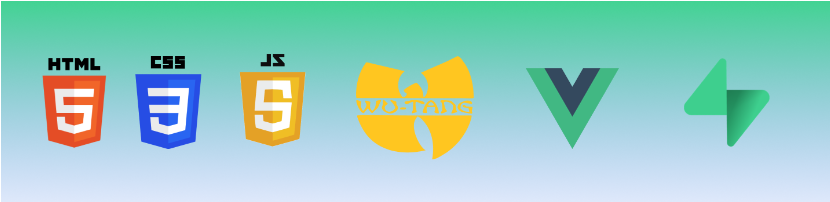

07 NOVEMBRE

Hem fet una introducció a git i hem après a utilitzar certs comandos, a clonar, exportar, penjar...
Després vàrem fer una introducció a HTML i vam veure els tipus d'elements semàntics d'HTML.

08 NOVEMBRE

Hem fet una introducció a CSS, hem vist la seva anatomia, selectors i pseudoselectors...

09 NOVEMBRE

Hem començat a estilar les nostres webs amb colors i contrastos, propietats de fonts i text.
Hem practicat amb formularis d'HTML i els models de caixes i posicionament.

10 NOVEMBRE

Avui hem estat veient més formes d'estilar webs, hem treballat el background image, i hem fet exercicis de formularis amb diferents inputs amb l'objectiu de poder rebre diferents dades de l'usuari.

11 NOVEMBRE

Hem estat treballant amb media query que serveix per modificar la nostra pàgina web segons el tipus de dispositiu amb què la fas anar. Seguidament, hem utilitzat flexbox que serveix per a modificar l'amplada, altura i posicionament dels elements de la nostra web. També hem vist les diferències entre elements en block o en línia. Els posicionaments i una molt petita introducció a JS

CONTINUEM!

14 NOVEMBRE

Avui ens hem introduït a JS. Els temes que hem tocat han sigut tipus de dades primitives. També hem vist que és una "array", que són els "objects" . Hem après a declarar variables, els operadors lògics de tipus booleà i els condicionals.

15 NOVEMBRE

Avui hem vist els diferents tipus de loops que hi ha. Hem treballat amb funcions i hem vist els mètodes que hi ha per les matrius.

16 NOVEMBRE

Avui dia 16, hem conegut que és el DOM. És com un arbre de "nodos"i cada un d'aquests "nodos" té les seves propietats i mètodes que poden ser manipulats amb js. Podem seleccionar elements i afegir estils, manipular atributs i recórrer elements, pare/fill. Podem accedir als elements utilitzant id, classes, tags.
